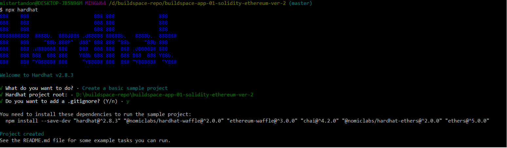

## buildspace-p01-ver-1-solidity-ethereum

Basic hardhat tasks:

```shell
npx hardhat accounts
npx hardhat compile
npx hardhat clean
npx hardhat test
npx hardhat node
node scripts/sample-script.js
npx hardhat help
```

> Set up local dev environment

```
mkdir buildspace-p01-ver-1-solidity-ethereum
cd buildspace-p01-ver-1-solidity-ethereum
npm init -y
npm install --save-dev hardhat
```

> How to up ethereum node and create basic project

```
npx hardhat
```

Once you run above command you must see option (like below)


In order to install missing dependency

```
npm install --save-dev "hardhat@^2.8.3" "@nomiclabs/hardhat-waffle@^2.0.0" "ethereum-waffle@^3.0.0" "chai@^4.2.0" "@nomiclabs/hardhat-ethers@^2.0.0" "ethers@^5.0.0"
```

Now you can compile test project

```
 npx hardhat compile
```

#### Deploy to Rinkeby testnet

```
npx hardhat run scripts/run.js
```

#### Deploy to Rinkeby testnet

> We'll need to change our hardhat.config.js file.

```
require("@nomiclabs/hardhat-waffle");

module.exports = {
  solidity: "0.8.0",
  networks: {
    rinkeby: {
      url: "YOUR_ALCHEMY_API_URL",
      accounts: ["YOUR_PRIVATE_RINKEBY_ACCOUNT_KEY"],
    },
  },
};
```

```
npx hardhat run scripts/deploy.js --network rinkeby
```
